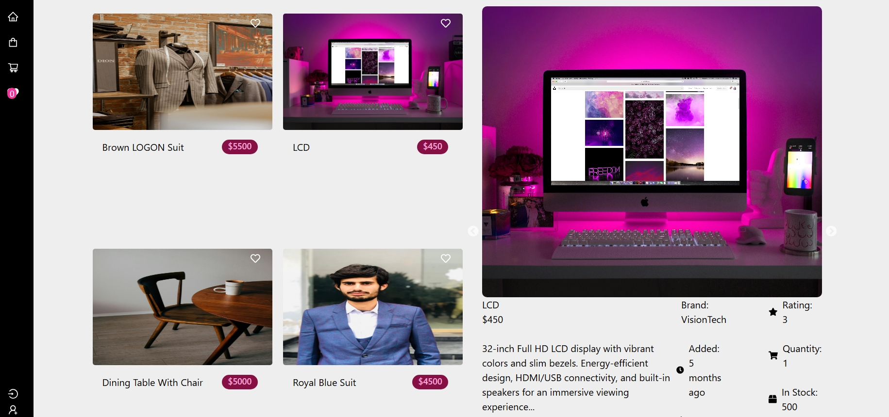
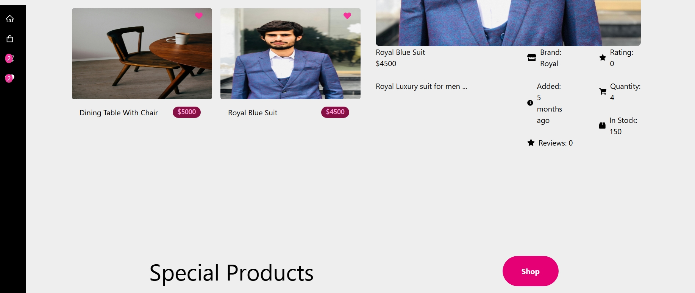
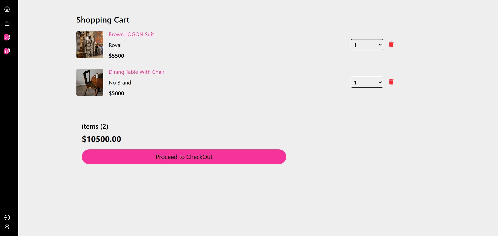

# MERN Stack E-Commerce Platform

## Overview
This project is a **full-stack e-commerce application** built using the MERN stack (MongoDB, Express.js, React, Node.js).  
It includes core shopping features such as product browsing, cart management, and favorites, demonstrating my ability to design and implement scalable web applications.

## Features
- User authentication (login/register)
- Product listing and detail pages
- Add/remove items from cart
- Add/remove items from favorites
- Checkout flow with order summary
- Responsive design for desktop and mobile

## Tech Stack
- **Frontend**: React, Redux Toolkit
- **Backend**: Node.js, Express.js
- **Database**: MongoDB
- **Authentication**: JWT
- **Deployment**: Localhost (future plan: deploy to Netlify + Railway/AWS)

## Screenshots




## Installation
```bash
# Clone the repository
git clone https://github.com/hassanalistudent/Ecommerse-Project.git

# Navigate into the project folder
cd Ecommerse-Project

# Install backend dependencies
npm install

# Navigate into the client folder and install frontend dependencies
cd frontend
npm install

# Run backend server
npm run backend

# Run frontend
npm frontend

# For full stack
npm run dev
